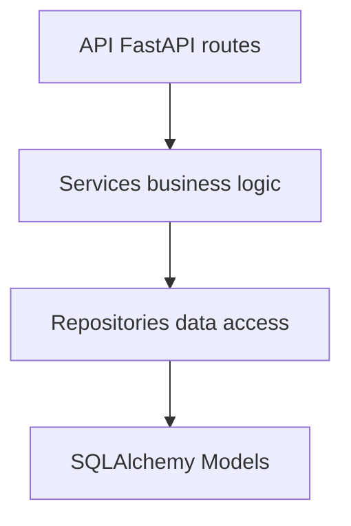

# 🚀 Talatrivia API

## 🌟 Project Overview

This repository contains a **FastAPI-based trivia system** built for the Talana technical challenge.

Users can:

* Participate in trivia sessions
* Answer questions with scoring based on difficulty
* Compete in rankings where:
  * Higher score wins
  * Time is used as tie-breaker

---

## 🛠️ Tech Stack

| Technology | Purpose |
| --- | --- |
| **Python 3.10 + Django** | Core language |
| **FastAPI** | REST API framework |
| **SQLAlchemy 2.x** | ORM layer |
| **Alembic** | Database migrations |
| **PostgreSQL / SQLite (tests)** | Persistence layer |
| **Docker + Docker Compose** | Containerized environment |
| **Makefile** | Standardized workflows |
| **Pytest** | Testing framework |
| **Ruff + MyPy** | Linting and static typing |

---

## 🧠 Core Domain

### Entities

* **User**
* **Trivia**
* **Question**
* **QuestionOption**
* **TriviaQuestion** (ordering inside trivia)
* **TriviaParticipant** (session state + scoring)
* **Answer**

---

## 📊 Business Rules

### Scoring System

* Easy → 1 point
* Medium → 2 points
* Hard → 3 points

### Trivia Flow

1. User is assigned to a trivia
2. First answer starts the session:
   * sets started_at
   * status → IN_PROGRESS
3. Each answer:
   * validates participation
   * prevents duplicates
   * updates score
4. Completion:
   * sets finished_at
   * status → COMPLETED

---

## 🏁 Ranking System

Ranking is determined by:

* Highest score (DESC)
* Fastest completion time (ASC)
* Participant ID (ASC fallback)

Time is computed dynamically:

```bash
finished_at - started_at
```

No redundant persistence of derived values.

---

## 🧱 Architecture

### Layers



---

## 📂 Project Structure

```bash
app/
├── api/
│   ├── dependencies/
│   └── routes/
├── core/
│   ├── config.py
│   ├── exceptions.py
│   └── security.py
├── db/
├── models/
├── repositories/
├── schemas/
├── services/
├── mappers/
└── main.py
```

---

## 🚀 Getting Started

### 1. Clone the repository

```bash
git clone https://github.com/UnderWeb/talatrivia-api-django.git
cd talatrivia-api-fastapi
```

### 2. Setup environment variables

```bash
cp .env.example .env
```

### 3. Start the application

```bash
make up
```

### 4. Run database migrations

```bash
make migrate
make seed-admin
```

### 5. Run tests

```bash
make test
```

---

## 🐳 Run the Project

### Start services

```bash
make up
```

### Stop services

```bash
make down
```

---

## 🔧 Development Commands

### Build

```bash
make build
```

### Run API

```bash
make up
```

### Logs

```bash
make logs
```

### Shell

```bash
make shell
```

---

## 🧪 Testing

```bash
make test
```

Run full test suite with pytest.

---

## 🧹 Code Quality

### Lint

```bash
make lint
```

### Format

```bash
make format
```

### Type check

```bash
make check
```

---

## 🧪 Database

### Migrations

```bash
make makemigrations
make migrate
make seed-admin
```

---

## 🧠 Design Principles

* Clear separation of concerns
* Domain logic isolated in services
* Repositories abstract persistence
* Deterministic ranking logic
* Strict validation in service layer
* No business logic in API layer

---

## ⚠️ Key Implementation Notes

### Trivia timing

* ```started_at``` is set on first answer
* ```finished_at``` is set on explicit completion
* No derived persistence fields (no stored duration)

### Ranking computation

* Done at service layer
* Uses SQL ordering + in-memory final mapping
* Avoids ORM N+1 via eager loading of user relation

---

## 📜 License

This project is licensed under the **MIT License** - see the [LICENSE](LICENSE) file for details.
